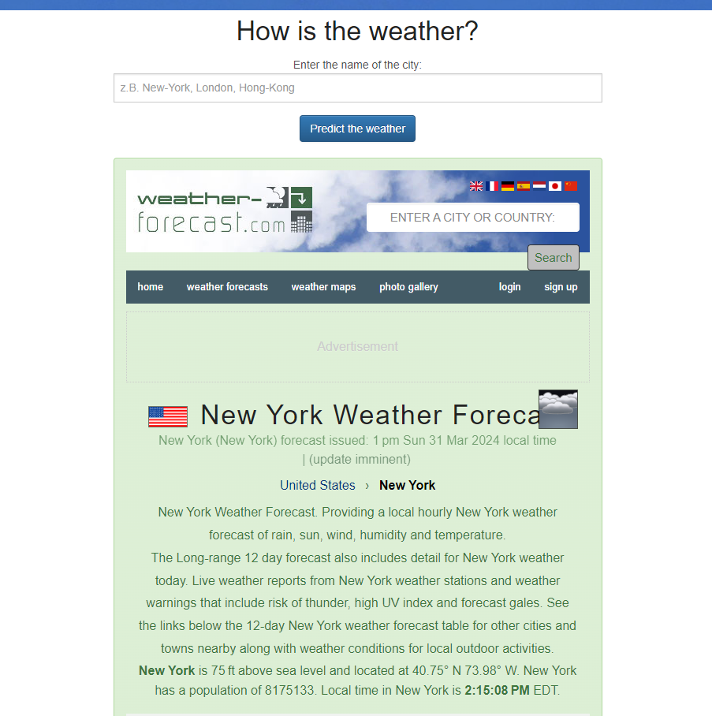

# Code Player

## :newspaper: About the project

A simple weather app using the API from [https://www.weather-forecast.com](https://www.weather-forecast.com) to check the weather in a city of your choice.

### How it works

1. Install [XAMPP](https://www.apachefriends.org/de/download.html)

2. Donwload the source code from github.

3. Move the source file into the `htdocs` folder where xampp was installed

4. Open `localhost/weather-app`

5. How the result looks like:

   Index page:

   

   After a request:

   

### Content overview

    .
    ├── img - folder contains all images
    ├── CODE_OF_CONDUCT.md - project code of conduct
    ├── COPYRIGHT - project copyright
    ├── index.php - program code of the web application
    ├── LICENSE - contains license text
    └── README.md - contains project information

## :notebook: Features

* Display latest weather news for a specific city

## :books: Resources used to create this project

* HTML
  * [HTML](https://html.spec.whatwg.org/multipage/)
* JavaScript
  * [JavaScript](https://developer.mozilla.org/en-US/docs/Web/JavaScript)
  * [JavaScript reference](https://developer.mozilla.org/en-US/docs/Web/JavaScript)
* PHP
  * [php](https://www.php.net/docs.php)
  * [PHP: Hypertext Preprocessor](https://devdocs.io/php/)
* CSS
  * [CSS](https://getbootstrap.com/docs/3.4/css/)
* Markdwon
  * [Basic syntax](https://www.markdownguide.org/basic-syntax/)
  * [Complete list of github markdown emofis](https://dev.to/nikolab/complete-list-of-github-markdown-emoji-markup-5aia)
  * [Awesome template](http://github.com/Human-Activity-Recognition/blob/main/README.md)
  * [.gitignore file](https://git-scm.com/docs/gitignore)
* Editor
  * [XAMPP](https://www.apachefriends.org/de/download.html)
  * [Visual Studio Code](https://code.visualstudio.com/)

## :bookmark: License

This project is licensed under the terms of the [GPL v3](LICENSE).

## :copyright: Copyright

See the [COPYRIGHT](COPYRIGHT) file for copyright and licensing details.

## :straight_ruler: Code of Conduct

Please review our [Code of Conduct](CODE_OF_CONDUCT.md) before contributing to this project.
